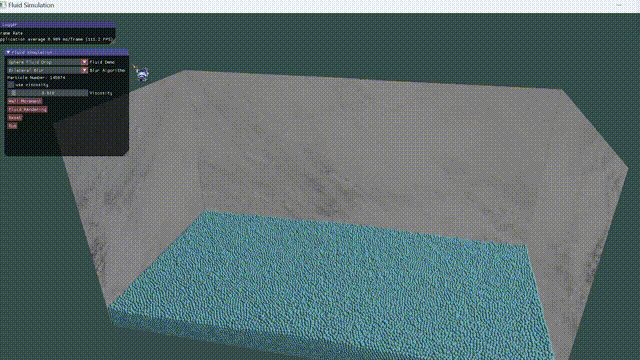
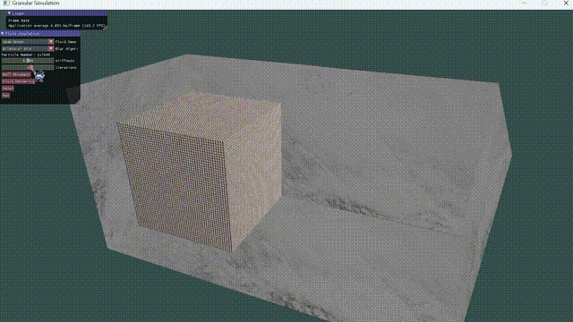

# Particle Simulation Of Fluid and Granular

This is the code of fluid and granular simulation using Position Based Dynamics(PBD) method.

Here are some details of my experiment device:

GPU： RTX 3050Ti Laptop

CPU: i7-12700H

For the fluid simulation(PBF) without rendering:

About 12w particles: average 130fps when wall isn't moving.

20w fluid particles: average 110 fps when wall is not moving.

Always keeping the max fps when only apply the distance constraint. (For me the data is 144 fps, it's up to the fresh rate of display device).

## Result

Fluid Simulation:

Also I implement the XSPH viscosity:

## Granular

The granular simulation is constrained by the Distance and Friction constraint ion. For more information, you can refer This paper "*[Unified Particle Physics for Real-Time Applications](https://dl.acm.org/doi/10.1145/2601097.2601152)*"

By changing the stiffness coefficient and the num of iteration, the result can be different. The frame rate would reduce because of the increasement of iteration.

